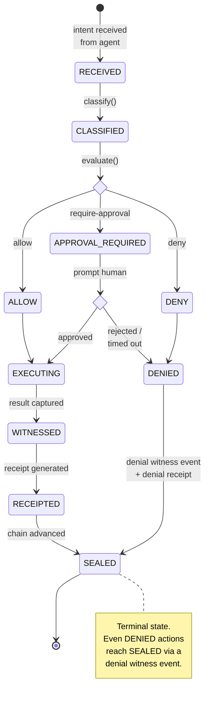
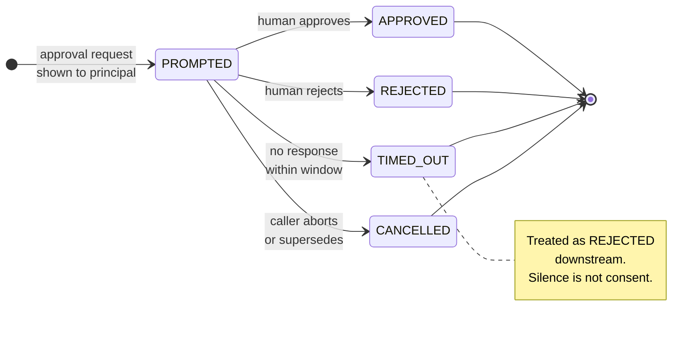
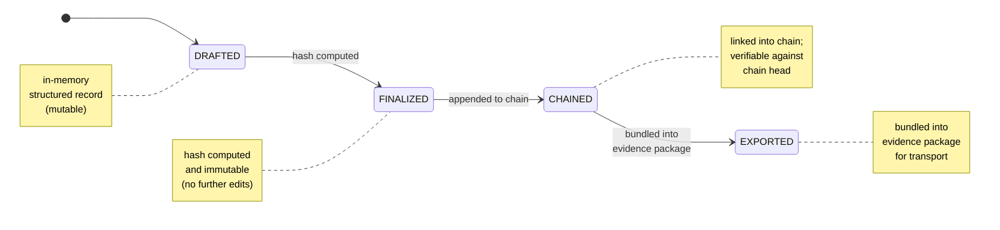
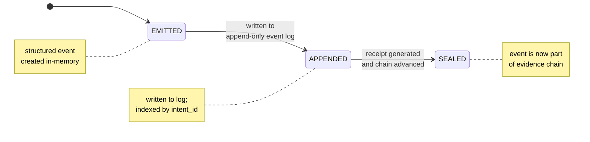
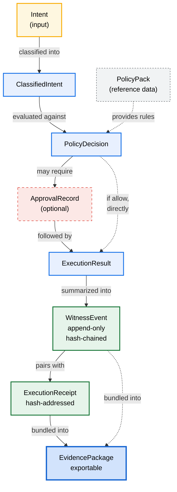
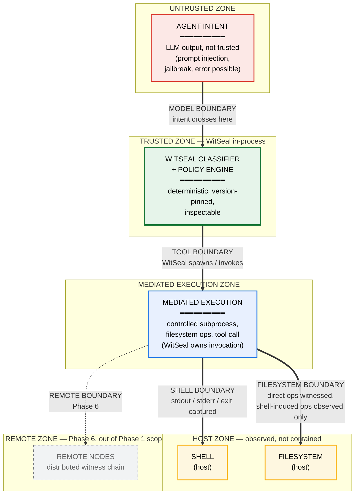

# WitSeal · ARCHITECTURE.md

## Phase 1 Runtime Architecture

Version: v0.3.0
Status: Pre-implementation reference. Frozen for Phase 1; revised at Phase 2 entry.
Date: 2026-05-08

---

## 1. Document Scope

This document defines the runtime architecture for WitSeal Phase 1: the
witnessed CLI runtime for AI coding agent actions on a single developer
machine.

**In scope:**
- Runtime pipeline (intent → evidence)
- State machines (execution, approval, receipt lifecycle, witness lifecycle)
- Trust boundaries (model, tool, shell, filesystem, remote)
- Schema relationships
- Failure modes and their handling

**Out of scope (deferred to later phases):**
- MCP runtime layer (Phase 4)
- Cryptographic signature scheme details — Sigstore integration (Phase 5)
- Remote witnessed execution protocol (Phase 6)
- PAI-Kernel constitutional substrate (Phase 8)

This document is the architectural contract Phase 1 implementation must satisfy. Deviations require an RFC.

### 1.1 Execution Modes

Phase 1 is one product with one receipt protocol, run in exactly two modes. The
mode is selected on the single execution command; **Gate is the default**:

```bash
witseal exec --mode gate|witness
```

- **Gate Mode** (default, `deny-by-default`) places WitSeal in the agent's
  critical path. The full governed pipeline runs: risk classification, policy
  evaluation, approval, and — when the policy decision is `deny` — the
  constraint blocks execution; the action does not run and the denial is
  recorded as evidence. With no `--mode`, WitSeal is Gate.
- **Witness Mode** (explicit, non-default) places WitSeal beside the agent's
  action path and does not block. WitSeal still classifies the action and
  evaluates policy, and records the policy decision — including a `deny` — as
  evidence, but does not enforce it: the action executes. The execution is
  recorded under a distinct outcome (`witnessed_executed`), never conflated with
  a blocked `denied_by_policy` action.

Both modes share the runtime pipeline, receipt protocol, evidence chain, schema
relationships, and trust-boundary model below: the evidence core (classify →
policy decision → witness → receipt → verify) is identical. The difference is
the constraint contour — whether the policy decision is enforced (Gate) or only
recorded (Witness). The constraint is by policy decision, not authorship. Phase 1
has no third mode; in particular, no guard or sandbox-execution mode.

---

## 2. The Runtime Pipeline

The diagram below is the full Gate-Mode pipeline. In Gate Mode, every
WitSeal-mediated action passes through these stages in this order; the order is
canonical and must not change without an RFC.

Witness Mode uses the same product, runtime pipeline, and receipt protocol. The
classification, policy decision, witness event, and execution receipt are all
produced and recorded; the difference is that the constraint is not enforced —
WitSeal is beside the action path and does not block, so the action executes
even when the policy decision is `deny` (recorded under `witnessed_executed`).

```mermaid
flowchart TD
    AGENT["AGENT (out of scope)<br/>Claude Code, Cursor, OpenCode, etc."]:::external

    AGENT -- "intent<br/>(action proposal)" --> CLASS

    CLASS["1. CLASSIFICATION<br/>━━━━━━━━━━<br/>Assigns risk class C0..C4 to intent.<br/>Pure function of intent + classifier rules."]:::stage
    CLASS -- "classified intent" --> POLICY

    POLICY["2. POLICY EVALUATION<br/>━━━━━━━━━━<br/>Applies policy packs to classified intent.<br/>Produces PolicyDecision:<br/>allow | deny | require-approval"]:::stage
    POLICY -- "policy decision" --> APPROVAL

    APPROVAL["3. APPROVAL (conditional)<br/>━━━━━━━━━━<br/>If decision is require-approval,<br/>prompt the human principal.<br/>Result: ApprovalRecord.<br/>Skipped if decision is allow or deny."]:::stage
    APPROVAL -- "approved action" --> EXEC

    EXEC["4. EXECUTION<br/>━━━━━━━━━━<br/>Mediated execution through controlled<br/>boundary (shell, filesystem, tool call).<br/>Captures stdout, stderr, exit code,<br/>side effects."]:::stage
    EXEC -- "execution result" --> WITNESS

    WITNESS["5. WITNESS<br/>━━━━━━━━━━<br/>Emits append-only WitnessEvent capturing<br/>intent, decision, approval, and execution<br/>summary. Linked to previous event by hash."]:::stage
    WITNESS -- "witness event" --> RECEIPT

    RECEIPT["6. RECEIPT<br/>━━━━━━━━━━<br/>Generates ExecutionReceipt:<br/>structured proof of completed action.<br/>Hash-addressable.<br/>Verifiable independently of producer."]:::stage
    RECEIPT -- "receipt" --> CHAIN

    CHAIN["7. HASH-CHAIN UPDATE<br/>━━━━━━━━━━<br/>Appends receipt hash to chain root.<br/>Chain head is the canonical state of<br/>WitSeal evidence at any moment."]:::stage
    CHAIN --> EVIDENCE

    EVIDENCE["8. EVIDENCE PACKAGE (on demand)<br/>━━━━━━━━━━<br/>Exportable bundle: events, receipts,<br/>chain root, policies in effect,<br/>classifier version.<br/>Independently verifiable."]:::output

    classDef external fill:#f5f5f5,stroke:#888,stroke-width:1px,color:#333
    classDef stage fill:#e8f0fe,stroke:#1a73e8,stroke-width:2px,color:#000
    classDef output fill:#e6f4ea,stroke:#137333,stroke-width:2px,color:#000
```



**Invariants enforced by the Gate-Mode pipeline:**

1. Every intent enters at step 1; intents cannot skip stages.
2. A `deny` decision at step 2 short-circuits steps 3–6 but still emits a witness event at step 5.
3. A `require-approval` decision that is denied at step 3 short-circuits steps 4–6 but still emits a witness event.
4. Step 5 is the only place witness events are created. No other code path may write to the chain.
5. Step 7 is atomic: the chain root either advances or does not. Partial advances are forbidden.
6. The chain head is always reproducible from the event log — the chain is derived, not stored separately.

The witness event, receipt, and hash-chain invariants remain evidence invariants
in both deployment modes. The policy-decision and approval-gate invariants above
are Gate-Mode invariants; Witness Mode makes no permissioned-execution claim.

---

## 3. State Machines

### 3.1 Execution State Machine

This execution state machine is the full Gate-Mode path. Witness Mode still
witnesses, receipts, and chains an observed action, but WitSeal is beside the
action path and does not exercise this policy and approval gate before the
action proceeds. Terminal states are bolded.



**Transition rules:**

- `RECEIVED → CLASSIFIED`: deterministic; pure function of intent + classifier version.
- `CLASSIFIED → ALLOW | APPROVAL_REQUIRED | DENY`: deterministic given (classified intent, active policy packs).
- `APPROVAL_REQUIRED → approved | rejected`: human input. Timeout policy (Section 7.2) determines behavior on no-response.
- `EXECUTING → WITNESSED`: must complete even on execution failure. A failed execution produces a witness event with `outcome: error`, not no event.
- `WITNESSED → RECEIPTED`: must produce a receipt for every witness event, including denied and errored actions.
- `RECEIPTED → SEALED`: chain head advance is atomic. If chain advance fails, action is `RECEIPTED` but not `SEALED`; runtime must retry or surface a hard error.
- `DENIED → SEALED`: denials produce a special witness event (no execution result) and a denial receipt, then advance the chain. Denials are first-class evidence.

**Forbidden transitions:**

- Any state → directly to `SEALED` without passing through `WITNESSED`. The chain only advances through witness events.
- `EXECUTING` → `RECEIVED`. There is no retry-as-new-action path; retries are new intents with new IDs.
- Skipping `RECEIPTED`. Every sealed action has a receipt, even if the action was denied or failed.

### 3.2 Approval State Machine

In Gate Mode, this state machine is triggered when policy evaluation produces
`require-approval`. It runs to terminal state before execution may proceed.



**Default behavior on TIMED_OUT:** treated as REJECTED. This is the Gate-Mode
`deny-by-default` principle applied to approvals: silence is not consent.

**ApprovalRecord schema (referenced by witness event):**

```
{
  "schema_version": "witseal.approval.v0.1",
  "approval_id": "apr_<uuid>",
  "intent_id": "int_<uuid>",
  "prompted_at": "<iso8601>",
  "resolved_at": "<iso8601>",
  "outcome": "approved" | "rejected" | "timed_out" | "cancelled",
  "principal": {
    "type": "human",
    "identifier": "<principal-id>"
  },
  "reason": "<optional human-provided text>",
  "timeout_seconds": <integer>
}
```

The approval record is sealed into the witness event for the action; it is not a separate chain entry.

### 3.3 Receipt Lifecycle

A receipt has four states. The receipt is the portable, verifiable artifact — its lifecycle determines what evidence claims WitSeal can support.



**State definitions:**

- **DRAFTED**: receipt structure is being assembled during/after execution. Mutable. Not addressable.
- **FINALIZED**: all fields populated, receipt hash computed. Immutable. Hash-addressable.
- **CHAINED**: receipt hash has been appended to the chain. Verifiable: given chain head and receipt, anyone can prove the receipt is in the chain.
- **EXPORTED**: receipt has been included in at least one evidence package. The receipt itself does not change in state; this is metadata.

**Verification claims:**

- A FINALIZED receipt: "this is a structured record of an action."
- A CHAINED receipt: "this action is part of WitSeal's evidence chain at chain head H."
- In Gate Mode, a CHAINED receipt + chain head + classifier version + active
  policies at the time: "this action passed WitSeal Phase 1 evaluation under
  these specific rules."

**What a Phase 1 receipt does NOT claim:**

- It is not signed by a non-producer party (Phase 5).
- It is not in a public transparency log (Phase 5).
- It does not prove the producer didn't tamper with the chain before exporting (Phase 5; in Phase 1 the chain is locally trusted).

These limitations must be documented in the public threat model (Section 7).

### 3.4 Witness Lifecycle



**Idempotence rule:** witness emit is idempotent on `intent_id`. A retry of intent `int_X` produces zero or one witness event for `int_X`, never more than one.

**Append-only invariant:** the witness event log is strictly append-only at the file system level. Edit operations are forbidden by the runtime; tampering is detectable by chain re-verification (Phase 5) or by simple log replay (Phase 1).

---

## 4. Schema Relationships

The five primary schemas form a graph:



The graph shows the full Gate-Mode pipeline relationships. Witness Mode uses the
same execution receipt and evidence chain, without a policy decision or approval
gate for the observed action.

**Critical relationships:**

- In Gate Mode, one intent → exactly one classified intent → exactly one policy decision.
- In Gate Mode, one policy decision → zero or one approval record (zero if decision is allow or deny).
- One execution → exactly one witness event → exactly one receipt.
- One witness event references the previous event by hash; the chain is total-ordered.
- In Gate Mode, one evidence package contains a contiguous range of witness
  events, their receipts, the policies in effect for that range, the classifier
  version, and the chain root at the start and end of the range.

---

## 5. Trust Boundaries

Phase 1 defines five trust boundaries. The boundary map is shared by both
deployment modes. The mediation steps that put WitSeal in the critical path are
Gate-Mode steps; in Witness Mode, WitSeal observes from beside the action path
and does not claim to gate or permission the action.



### 5.1 Model Boundary

**What it separates:** the agent's LLM-generated intent from WitSeal's deterministic evaluation.

**Trust assumption:** the agent's intent is **untrusted input**. The agent may have been prompt-injected, jailbroken, or simply wrong. WitSeal does not verify the agent's reasoning; it evaluates the proposed action.

**Mediation:** In Gate Mode, WitSeal classifies and evaluates *what the agent
proposes to do*, not *why it proposes it*. The classifier and policy engine are
deterministic, version-pinned, and inspectable.

**Evidence claim:** In Gate Mode: "This is the action the agent proposed and
the decision WitSeal made about it." WitSeal does **not** claim "the agent's
intent was legitimate."

**Out of scope for Phase 1:** detecting prompt injection, jailbreaks, or model misalignment. These are model-layer problems; WitSeal operates downstream.

### 5.2 Tool Boundary

**What it separates:** WitSeal's mediation logic from the actual mechanism by which an action takes effect (shell subprocess, filesystem syscall, tool API call).

**Trust assumption:** the tool layer is host-native. WitSeal does not introspect what a shell command does after spawning it; it captures inputs and outputs at the boundary.

**Mediation:** In Gate Mode, WitSeal owns the spawning / invocation. The agent
does not directly invoke `child_process.exec`; it sends an intent to WitSeal
which, after evaluation, invokes the tool layer with the exact captured
arguments.

**Evidence claim:** In Gate Mode: "This is the exact
command/argument/payload that was passed to the tool layer, and this is what
came back."

**Phase 1 scope:** shell commands, filesystem reads/writes. MCP tool calls (Phase 4) and remote tool invocations (Phase 6) extend this boundary.

### 5.3 Shell Boundary

**What it separates:** the WitSeal-mediated subprocess from the host shell environment.

**Trust assumption:** the host shell is trusted to execute the command faithfully. WitSeal does not run inside a sandbox in Phase 1; it observes execution from outside.

**Mediation:** In Gate Mode, WitSeal spawns subprocesses with explicit argv (no
`sh -c "..."` string interpolation that obscures arguments), captures
stdout/stderr, records exit code, and produces a stdout_hash and stderr_hash for
the receipt.

**Evidence claim:** In Gate Mode: "This subprocess was spawned with these
exact arguments, exited with this code, and produced output with these content
hashes."

**Phase 1 limitation:** In Gate Mode, WitSeal does not prevent a malicious agent
from achieving an effect through a shell command that is allowed by policy.
Policy authoring is the responsibility of the user; WitSeal proves what was
attempted and what happened.

### 5.4 Filesystem Boundary

**What it separates:** mediated filesystem operations from arbitrary host filesystem access.

**Trust assumption:** the host filesystem semantics are trusted. WitSeal does not interpose at the syscall layer in Phase 1.

**Mediation:** In Gate Mode, filesystem operations performed *through* WitSeal's
tool layer (e.g., a `write_file` action) are mediated and witnessed. Filesystem
operations performed *by* an executed shell command are observed only via
stdout/stderr capture and exit code.

**Evidence claim:** In Gate Mode: "These specific file operations were
performed through WitSeal." WitSeal does **not** claim "these are the only
files the agent's actions touched" — an executed shell command may have touched
files that WitSeal does not observe.

**This limitation must be documented in the threat model.** It is a known gap, addressed in Phase 5 with kernel-level mediation.

### 5.5 Remote Boundary

**Phase 1: not in scope.** WitSeal Phase 1 runs entirely on a single developer machine. There is no remote witness service, no distributed evidence chain, no cross-node verification.

**Phase 6 will introduce:**
- Remote witness service (central or federated)
- Distributed evidence chain semantics
- Cross-node verification
- Operator-mode execution (agent runs on a remote node, witness chain syncs to a local verifier)

**Anchor for forward design:** the receipt schema in Phase 1 must already include fields that make Phase 6 federation possible (originating-node ID, chain-segment identifier). These fields are present-but-unused in Phase 1.

---

## 6. Determinism Requirements

For the runtime pipeline to support replay, several stages must be
deterministic. The policy-evaluation and approval rows describe the full
Gate-Mode pipeline; the evidence reconstruction requirements are shared by both
deployment modes.

| Stage | Determinism requirement | What this implies |
|---|---|---|
| Classification | Deterministic given (intent, classifier version) | Classifier rules are version-pinned; classifier upgrades produce a chain segment boundary |
| Policy evaluation | Deterministic given (classified intent, active policy packs) | Policy packs are version-pinned and frozen for an evidence chain segment |
| Approval | Non-deterministic (human input) but recorded | Approval outcome is captured; replay does not re-prompt |
| Execution | Non-deterministic (real-world side effects) | Execution result is captured exactly; replay does not re-execute |
| Witness | Deterministic given (decision, approval, result) | Witness event is a pure function of pipeline state |
| Receipt | Deterministic given witness event | Receipt hash is reproducible from witness event content |
| Hash-chain | Deterministic given (previous chain head, receipt hash) | Chain head is reproducible from event log |

**The replay invariant:** given an evidence package, a verifier can reconstruct
the chain head deterministically. In Gate Mode, the verifier uses the same
classifier version and policy packs for the policy-dependent stages. If the
reconstruction differs from the recorded chain head, evidence has been tampered
with.

This is the entire point of Phase 1's hash-chain: to make tampering detectable through replay, without yet requiring third-party signatures (those come in Phase 5).

---

## 7. Failure Modes and Their Handling

The classifier, policy, approval, and policy-pack failure modes below describe
Gate Mode where they depend on the policy and approval gate. The execution,
receipt, and hash-chain evidence failures remain relevant to both deployment
modes.

### 7.1 Classifier failure

**Scenario:** classifier throws an unexpected error on a malformed intent.

**Handling:** the runtime treats classification failure as risk class C4 (highest). Policy evaluation receives "classification failed" as input; default policy pack denies on C4.

**Evidence:** witness event records `classification_outcome: error` with the error message. Action is `DENIED`.

**Why this matters:** silence is not consent. A failed classifier must not result in an unclassified action proceeding.

### 7.2 Approval timeout

**Scenario:** approval is required, principal does not respond within timeout window.

**Handling:** approval is treated as `REJECTED`. Default timeout is **deny-leaning** — silence is not consent.

**Configurable:** users may extend timeout windows for low-risk actions but cannot configure timeout to result in implicit approval.

**Evidence:** witness event records the approval record with `outcome: timed_out` and final policy outcome `denied`.

### 7.3 Execution failure

**Scenario:** subprocess crashes, syscall errors, tool API returns 5xx.

**Handling:** execution failure is captured. Witness event records `execution_outcome: error` with stderr content (hashed) and exit code (or equivalent).

**Receipt:** generated normally, with `outcome: error`. Failed actions are first-class evidence.

**Replay:** recorded execution result is replayed verbatim. Replay does not re-attempt failed actions.

### 7.4 Hash-chain advance failure

**Scenario:** receipt is FINALIZED but appending to the chain fails (disk full, file permissions, concurrent access).

**Handling:** runtime surfaces a hard error to the caller. Action is `RECEIPTED` but not `SEALED`. The runtime refuses further actions until the chain is recovered or explicitly reset.

**Recovery:** chain integrity check on startup. If the recorded chain head does not match the computed chain head from the event log, the runtime starts in **read-only mode** and surfaces the integrity error.

**Why this matters:** an unsealed action is invisible to the chain. Allowing the runtime to continue accepting new actions while the previous one is unsealed creates evidence-chain holes — the exact failure mode that destroys credibility.

### 7.5 Concurrent invocation

**Scenario:** two agent processes call `witseal exec` simultaneously.

**Handling Phase 1:** chain advance is serialized via file lock on the chain head. Concurrent intents are queued; chain advances atomically per intent.

**Limitation:** queuing introduces head-of-line blocking under high concurrency. Phase 1 targets single-developer-machine workloads where this is acceptable. Phase 4+ may require a more sophisticated chain advance protocol.

### 7.6 Policy pack version mismatch

**Scenario:** evidence chain segment was sealed under policy pack v1.2; verifier has only v1.3.

**Handling:** evidence package includes the exact policy pack content (or a content hash + reference) used at chain time. Verifier resolves the historical pack from the package, not from current configuration.

**Why this matters:** policies evolve. The verification claim is "this action was allowed by policies in effect at the time," not "this action would be allowed by current policies."

---

## 8. What Phase 1 Does Not Provide (Honest Limitations)

These are documented limitations of Phase 1, not features. They must appear in the public threat model.

1. **No third-party signatures.** Receipts are hash-chained but not signed by a non-producer. A producer with full filesystem access can rewrite the entire chain consistently. Phase 5 introduces Sigstore-based signing and Rekor transparency log integration to address this.

2. **No kernel-level mediation.** WitSeal observes shell command outcomes via stdout/stderr/exit-code capture. A malicious shell command may perform side effects that WitSeal does not directly witness. Phase 5 introduces kernel-level interposition (eBPF / ptrace) to close this gap on supported platforms.

3. **No prompt-injection defense.** In Gate Mode, WitSeal evaluates proposed
actions, not the model output that produced them. If a prompt-injected agent
proposes an action that policy allows, Gate Mode will allow it. The boundary is
intentional: WitSeal is action governance, not model security. Pair WitSeal
with a prompt-injection-aware gateway for defense in depth.

4. **No remote witness chain.** Phase 1 is single-node. Multi-node evidence federation is Phase 6.

5. **No identity layer.** WitSeal does not authenticate agents, mint scoped tokens, or manage access at the identity layer. Pair with Strata-style identity gateway products if identity is required.

6. **No replay-during-execution.** Replay is post-hoc reconstruction from evidence. Phase 1 does not support speculative re-execution or what-if analysis.

7. **No automatic remediation.** When Gate Mode denies an action, the agent is
told the action was denied. The agent must adapt; WitSeal does not propose
alternatives.

These limitations are honest. Documenting them is a trust signal, not a weakness.

---

## 9. Schema Versioning Policy

All schemas (witness, receipt, policy, approval, evidence package) are versioned `vMAJOR.MINOR`.

- **MINOR bump** (v0.1 → v0.2): additive fields. New fields are optional; old verifiers ignore them gracefully.
- **MAJOR bump** (v0.x → v1.x): breaking changes. Requires migration tooling; chains across major versions are explicitly segmented.

Phase 1 ships at v0.1 of all schemas. v1.0 is targeted for the end of Phase 5 (integrity hardening), when the schemas are formally frozen for production.

Every schema change requires an RFC. The RFC must address:
- Compatibility impact
- Migration path
- Verifier behavior on mixed-version chains

---

## 10. Implementation Constraints (Reminders)

These constraints flow from the product strategy doctrine and constrain implementation choices:

- **Single binary.** Phase 1 deliverable is a Node.js CLI installable via `npm i -g @witseal/cli` or `brew install witseal`. No daemons, no servers, no databases.
- **No browser storage.** Phase 1 does not run in a browser. Localstorage and similar APIs are not used.
- **Append-only event log.** The event log is a JSONL file, append-only, with one event per line.
- **In-process classifier and policy engine.** No subprocess or RPC for the hot path; classification and policy evaluation are sub-millisecond operations in-process.
- **Performance budget.** p99 mediation overhead < 100 ms in Phase 1; target < 20 ms by Phase 5. This is the developer-experience constraint that defines whether WitSeal is *adopted* or *worked around*.
- **No network calls in the hot path.** The runtime never blocks on a network call during action evaluation. Background metrics, sync, or witness federation (Phase 6+) happen out-of-band.

---

## 11. Architectural Decision Records (ADRs)

Every non-trivial architectural decision in this document should have an ADR in `docs/adr/`. ADRs document **why**, not just **what**. The format:

```
# ADR-NNNN: <decision title>

## Status
proposed | accepted | superseded by ADR-XXXX

## Context
<the problem being decided>

## Decision
<what was decided>

## Consequences
<positive and negative consequences, including known limitations>

## Alternatives considered
<options rejected, with rationale>
```

**Phase 1 ADRs to write before implementation begins:**

- ADR-0001: Hash-chain construction (per-event vs Merkle tree)
- ADR-0002: Event log format (JSONL vs binary; flat file vs SQLite)
- ADR-0003: Policy pack format (declarative DSL vs general-purpose code)
- ADR-0004: Approval prompt UX (TUI vs deferred to client-supplied callback)
- ADR-0005: Subprocess capture mechanism (pipe inheritance vs PTY)
- ADR-0006: Concurrency model (file lock vs single-writer process)

These ADRs are written before any non-trivial code is committed. They become the reference for implementation review.

---

## 12. The One-Paragraph Summary

WitSeal Phase 1 is one product with one receipt protocol and exactly two
deployment modes. Witness Mode sits beside the agent's action path: it observes
the action, witnesses it, and emits hash-chained, replayable evidence without
gating the action. Gate Mode runs the full deterministic pipeline: every intent
is classified, evaluated against policy, optionally approved, executed through a
controlled boundary, witnessed, receipted, and chained, with
`deny-by-default`. Both modes share the evidence chain; replay reconstructs it
from evidence alone. What Phase 1 does not do — third-party signing,
kernel-level mediation, remote federation, prompt-injection defense — is
documented honestly and addressed in later phases. The architecture's job is to
make later phases additive, not retroactive.


---

## Implementation Baseline

The reference implementation is a TypeScript runtime on Node.js — the
public, client-facing line and the basis of the `0.1.0` release. The
table below records the implementation baseline as of this revision.
Pinned versions are an implementation detail; the source of truth for
exact versions is `package.json` together with the lockfile.

| Layer | Technology |
|---|---|
| Runtime | Node.js |
| Language | TypeScript |
| CLI | commander |
| Validation | zod |
| Logging | JSONL |
| Integrity | crypto hash chain |
| Tests | vitest |

Long-term language-layer architecture: TS surface / Rust trust core /
Python SDK. Rust is the hardened parallel track — hardened
execution, sandboxing, cryptographic witness engine. Python is the
SDK / verifier line.
